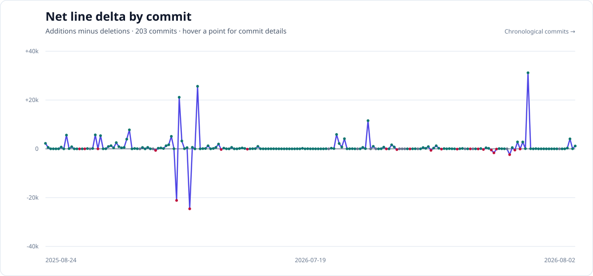

# Averlo Next Template


Choose a route profile, materialize a clean project, and build its design system
on a focused Next.js App Router foundation.

Averlo provides marketing, authentication, dashboard, and local developer
surfaces without turning the generated project into a demo-heavy product. Its
frontend stays source-agnostic: server-side resolvers turn fallback or Payload
documents into lightweight page, layout, and section props.

## Repository Change History



Each point is one commit, ordered chronologically. The y-axis is net lines
changed: additions minus deletions. The chart is refreshed on pushes to `main`.

## Instant Setup

Template repository: [github.com/olafBobryk/averlo-next-template](https://github.com/olafBobryk/averlo-next-template)

### Agent Bootstrap

Copy this prompt into Codex or another coding agent:

**Create a project from `https://github.com/olafBobryk/averlo-next-template`.
Read `AGENTS.md` and `README.md`; help me
choose a route profile; materialize it into a new folder; and verify the result
before project-specific work. Preserve the existing UI primitives, marketing
layout contract, resolvers, and isolated agent dev workflow. Keep secrets,
environment files, generated indexes, build output, and local service metadata
out of Git.**

Equivalent shell-first setup:

```sh
git clone https://github.com/olafBobryk/averlo-next-template.git averlo-template
cd averlo-template
npm install
npm run create:project -- --profile <profile> --content <content> --output ../my-project
```

Then work from the generated project:

```sh
cd ../my-project
npm run dev
```

## Choose a Profile

Profile selection is the main setup decision:

| Profile | Included surfaces | Content choices | Default |
| --- | --- | --- | --- |
| `full` | Marketing, auth, dashboard, and developer tools. | `static`, `payload-ready` | `payload-ready` |
| `app-only` | Auth, dashboard, and developer tools; no marketing. | `static` | `static` |
| `marketing-only` | Marketing and developer tools; no auth or dashboard. | `static`, `payload-ready` | `payload-ready` |
| `thin-start` | Minimal marketing specialist surface. | `static`, `payload-ready` | `payload-ready` |

Generated projects are one-way starting points rather than alternate states of
this checkout. Positive assembly copies only selected, explicitly owned project
code and omits template profiles, inventories, and creation machinery.

## How It Works

- **Route profiles** decide which production surfaces belong in the generated
  project.
- **Developer routes** under `/internal` are local-development tools, not public
  product surfaces.
- **Shared primitives** provide reusable UI, overlay, motion, focus, and branding
  foundations.
- **Marketing documents** describe site layout, pages, and named sections.
- **Server resolvers** adapt fallback or Payload data into small render props.
- **Section renderers** own presentation without importing Payload document
  shapes.

The content source is replaceable; the layout contract and section renderers
remain stable.

## Content Modes

Marketing-capable profiles support three content states:

- **Static:** render committed TypeScript fallback content without Payload.
- **Payload-ready:** retain the guarded scaffold while admin and API routes stay
  inactive.
- **Payload-powered:** activate the real admin/API routes with Neon Postgres and
  Vercel Blob.

No generated profile is Payload-powered by default. Read
[`docs/guides/payload-vercel-neon-blob.md`](docs/guides/payload-vercel-neon-blob.md)
before activation.

The marketing layout model and resolver boundary already exist. When using the
optional `$cms-backfill` workflow, treat that model as an input to preserve and
populate—not as a missing schema or permission to introduce a reorderable page
builder.

## Public Safety

This repository is designed to remain safe as a public template. Do not commit
secrets, tokens, deploy hooks, database URLs, Payload secrets, environment files,
generated agent indexes, local Vercel metadata, build output, dependency folders,
raw client files, or throwaway worktrees.

Use ignored local files or platform environment stores for secrets. Keep
source-specific CMS and deployment details behind server-side adapters so the
frontend continues to render the same small contract.

## Core Workflows

### Development

Use `npm run dev` for the isolated, prewarmed preview workflow. It selects a
random port and an isolated build directory, then warms the home route before
reporting the preview ready. Existing automation can continue using the
`dev:agent` alias. Use `npm run dev:local` only when a stable local server is
actually needed:

```sh
npm run dev
```

### Template Intelligence

Generate the lightweight local map before substantial work, then query a focused
topic such as `route-architecture`, `ui-primitives`, or `content-modes`:

```sh
npm run intelligence:generate
npm run intelligence:query -- content-modes
```

Serena is an optional warm semantic service, not a setup prerequisite. See
[`docs/guides/template-intelligence.md`](docs/guides/template-intelligence.md).

### Thin Start

`thin-start` can also be reviewed as an isolated workspace before committing to
that profile. Create it with the normal project command, then run
`npm run review:thin-start-api -- --root <output> --strict` from the template.

### Scroll Performance

The repository includes real-page measurement and disposable autoresearch
worktrees for scroll-sensitive changes. Use them when motion, shared shell
behavior, or expensive sections change; see
[`docs/guides/scroll-performance.md`](docs/guides/scroll-performance.md).

## Repository Map

```text
.
|-- AGENTS.md               Agent and repository boundaries
|-- docs/guides/            Active setup and operational guides
|-- scripts/                Creation, development, and verification tooling
|-- src/app/                Marketing, auth, dashboard, Payload, and API routes
|-- src/components/         Shared UI and product components
|-- src/lib/marketing-content/  Layout contract, fallback data, and resolvers
`-- src/payload/            Guarded Payload-ready infrastructure
```

## Essential Scripts

| Script | Purpose |
| --- | --- |
| `npm run create:project` | Materialize a route profile into a project workspace. |
| `npm run dev` | Start an isolated, prewarmed preview on a random port. |
| `npm run dev:local` | Start the former local server flow on port 3000–3010. |
| `npm run dev:agent` | Compatibility alias for `npm run dev`. |
| `npm run dev:inspect` | Start a preview with the code-inspector sidecar enabled. |
| `npm run verify:static` | Run static policy, formatting, and type checks. |
| `npm run verify:profiles` | Materialize and verify every profile. |
| `npm run build` | Create the production Next.js build. |

## Deployment

The template targets Vercel. Static and Payload-ready projects deploy without
live Payload routes. Payload-powered projects use Neon for `DATABASE_URL`,
Vercel Blob for `BLOB_READ_WRITE_TOKEN`, and a project-specific
`PAYLOAD_SECRET`; follow the Payload deployment guide before enabling them.

## Further Reading

- [Auth and organization adapters](docs/guides/auth-organization-adapters.md)
- [Payload on Vercel with Neon and Blob](docs/guides/payload-vercel-neon-blob.md)
- [Scroll-performance workflow](docs/guides/scroll-performance.md)
- [Template Intelligence](docs/guides/template-intelligence.md)
